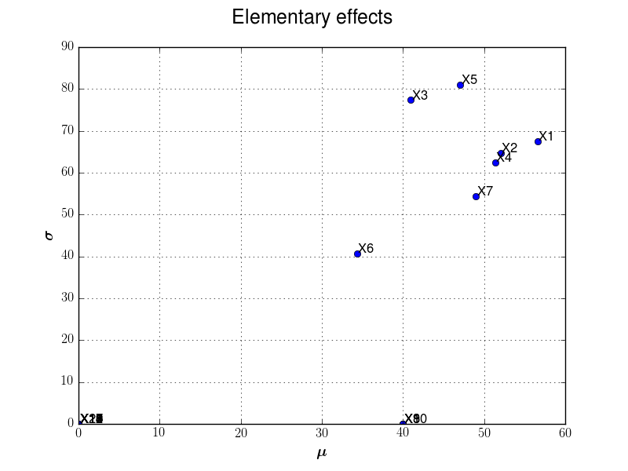
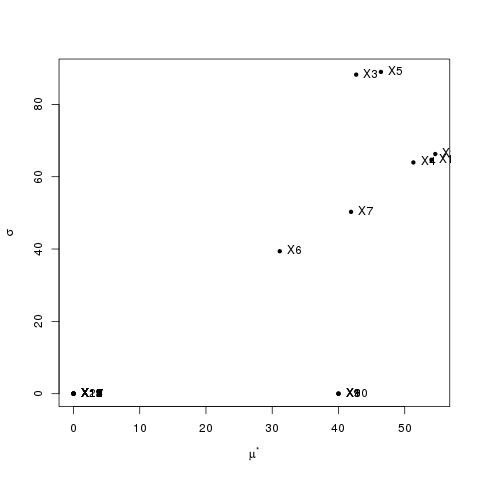

Validation
==========

Morris Test case
----------------

The purpose here is to estimate the elementary effects on the Morris Use Case and compare issued results with litterature and other sensitivity tools.
As the Morris method is a screening, the validation relies on graphical observations.

1- Problem statement
````````````````````
The objective is to compute absolute mean and standard deviation of elementary effects, observed with r=10 trajectories.
From these values, graphical observations lets define several groups (at least 3):

 - A group with variables that have negligible effects on the output,
 - A group with variables that have linear effects on the output,
 - A group with variables that have significant and non linear (or with interactions) effects on the output.

We recall that with the Morris use case, all variables are independent and uniform in [0,1].
Also, some parameters of the model are supposed to be gaussian with parameters :math:`\mu=0, \sigma=1`.
We fix however these variables to be equal to 1e-3.


2- Analysis
```````````
We fix :math:`r=100` trajectories. Also, input domain is defined as a p-level grid with :math:`p=5`.

We plot hereafter results obtained with the module (left) and those issued from the `R sensitivity` package (right).




We note that the results seem very close. Indeed, we may note that from a important number of trajectories, we get the same group structure:

 - The variables with linear effects (:math:`X_8,\ X_9\ and\ X_{10}`),
 - The variables that have significant and non linear (or with interactions) effects (:math:`X_1\ to\ X_7`),
 - The group with variables that have negligible seems to be the same with the two tools (the other variables from :math:`X_{11}\ to\ X_{20}`).

The results are satisfying.


3- Remarks
``````````
For the illustrated use case, we use same parameters for the Morris function even if sampling input and trajectories differ. As a screening method, the interest of comparing numerical values is limited.
More than this validation use case, we had compared several ones with random coefficients and results seem close, which validate the estimation of elementar effects in the module.
