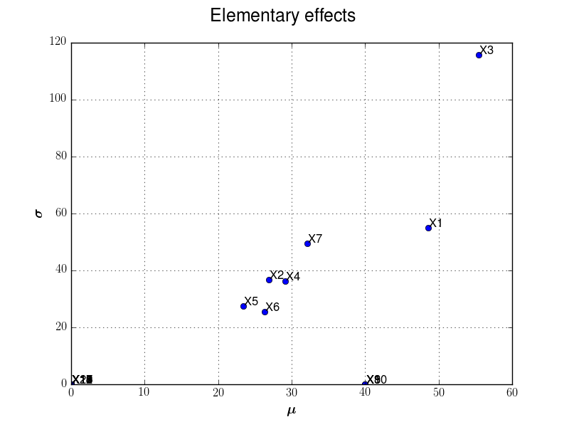
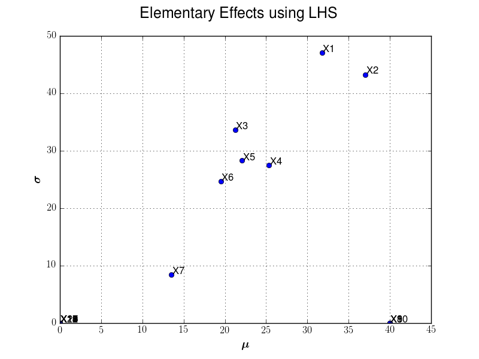

Examples
========

This section illustrates how to use the module to evaluate the Morris screening effects.

The illustration is done with the `Morris` function example, with f: :math:`f:\Rset^{20} \rightarrow \Rset`. Each input variable is uniform with bounds 0 and 1.

Two cases are illustrated:
  - In the first one, we use p-level grid experiments to generate input paths,
  - In the second example, an LHS experiment is used instead.

Example 1: Morris test and p-level input grid
---------------------------------------------

To define the trajectories, we suppose that the box :math:`[0,1]^{20}` is splitted into a p-level grid (p=5).

We set the number of trajectories input variables are randomly to 10.

.. literalinclude:: example.py
    :language: python

We illustrate here after sensitivity graph issued from such analysis:

Example 2: Example 1: Morris test and LHS input design
------------------------------------------------------

To define the trajectories, we first get an LHS design in the box :math:`[0,1]^{20}` of :math:`size=50`

We set the number of trajectories input variables are randomly to 10.

.. literalinclude:: examplelhs.py
    :language: python

We illustrate here after sensitivity graph issued from such analysis:

